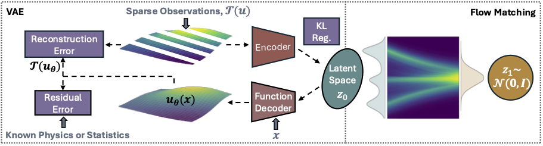

## Constrained Latent Flow Matching (C-LFM) for Random Fields



This repo contains the code and data used to reproduce the results in the paper:
```
Generative Modeling of Random Fields from Limited Data via Constrained Latent Flow Matching (2025).
J. E. Warner, T. A. Shah, P. E. Leser, G. F. Bomarito, J. D. Pribe, M. C. Stanley. 
```

## Abstract
 Deep generative models are promising tools for science and engineering, but their reliance on abundant, high-quality data limits applicability. We present a novel framework for generative modeling of random fields (probability distributions over continuous functions) that incorporates domain knowledge to supplement limited, sparse, and indirect data. The foundation of the approach is latent flow matching, where generative modeling occurs on compressed function representations in the latent space of a pre-trained variational autoencoder (VAE).  Innovations include the adoption of a function decoder within the VAE and integration of physical/statistical constraints into the VAE training process.  In this way, a latent function representation is learned that yields continuous random field samples satisfying domain-specific constraints when decoded, even in data-limited regimes. Efficacy is demonstrated on two challenging applications: wind velocity field reconstruction from sparse sensors and material property inference from a limited number of indirect measurements. Results show that the proposed framework achieves significant improvements in reconstruction accuracy compared to unconstrained methods and enables effective inference with relatively small training datasets that is intractable without constraints. 


## Installation
There are `requirements.txt` and `environment.yml` files that list the specific versions of packages used in this work. Otherwise, the base dependencies can be installed manually as follows:

### conda
```
conda install pytorch torchvision torchaudio pytorch-cuda=11.8 -c pytorch -c nvidia
conda install lightning -c conda-forge
conda install h5py
conda install scipy
```

### pip
```
pip install matplotlib
pip install seaborn
pip install pandas
pip install numpy
pip install torchdyn
pip install einops
```
Install local source:
```
pip install -e .
```

## Scripts
The `scripts` folder has subdirectories with train and test scripts to perform C-LFM for each of the four numerical examples from the paper:
- `gaussian_process`: Demonstration 1: Random Field Reconstruction from Sparse Data
- `poisson_1d`: Demonstration 2: Random Field Inference from Limited and Indirect Data
- `wind`: Application 1: Wind Velocity Field Estimation
- `materials`: Application 2: Material Property Characterization

To process for performing end-to-end training and then testing for each problem is executed by running the following scripts in order:
1. `train_vae.py`
2. `test_vae.py` (optional)
3. `train_lfm.py` 
4. `test_lfm.py` 

Step 1 pre-trains the VAE by implementing Algorithm 1 from the paper, step 3 trains a flow matching model on the latent space of the pre-trained VAE following Algorithm 2, and step 4 generates samples via latent flow matching following Algorithm 3. Step 2 is an optional step for testing the quality of the pre-trained VAE by encoding and decoding training data samples. The test scripts create some basic plots comparing generated samples to test data.

### Train and Test Data

The demonstration problems, `gaussian_process` and `poisson_1d` create train and test data on the fly. Train and test data is included in the repo for the `materials` application in the `data/materials` directory. Train and test data for the `wind` application was not included with the code due to their size, instead the `data/wind_data_generation/generate_wind_data.py` script needs to be run to create the datasets prior to training.

### Command Line Arguments

All scripts accept command line arguments to adjust hyperparameters and other details of the problem. The defaults are set to reasonable values that were used to produce the results in the paper. The exception being that the `gaussian_process` example must be run with `--use_cov` to engage the covariance constraint (it uses a correlation constraint by default) and the `wind` example must be run with `--sparse_sensors` to match the setup used in the paper. See the individual scripts for all command line arguments.

### Model Checkpoints and logging

Results and model checkpoints are written to directories that are named based on the values of the command line arguments used. Each problem's subdirectory has a `<problem_name>_utils.py` file defining `get_logging_path_and_name` that specifies the results directory. A consequence of this structure is that the same command line arguments used to run `train_vae.py` in step 1 need to also be used in the subsequent steps in order to load stored models correctly. For example, to run the `gaussian_process` example with covariance constraint and three sensors for 5000 epochs:

- `python scripts/gaussian_process/train_vae.py --use_cov --epochs 5000 --num_sensors 3`
- `python scripts/gaussian_process/train_lfm.py --use_cov --epochs 5000 --num_sensors 3`
- `python scripts/gaussian_process/test_lfm.py --use_cov --epochs 5000 --num_sensors 3`


## C-LFM Package

The `clfm` package contains Python files implementing the core C-LFM functionality used by the scripts above, split across three subdirectories:

### `nn`

Contains the neural network classes that implement C-LFM. `fully_connected_nets.py` contain simple encoder, branch, trunk, and flow matching networks implemented with MLPs. `unet1d.py` contains the encoder used by the `wind` problem based on the U-Net architecture. `vae.py` contains the `FunctionalVAE` that implements the proposed VAE architecture with function decoder based on DeepONets that uses additional residual loss terms to incorporate physical and statistical constraints into the learning of latent function representations for random fields.

### `problems`

Contains problem specific Python files for each of the four examples from the paper. Each problem defines a custom `PyTorch` `Dataset` class as well as a `Loss` class that implements `reconstruction` and `residual` methods to define the problem's VAE loss terms. Additionally, there is a `validate` method which runs any problem specific validation metrics and returns them as a dictionary for logging. To customize the source code to solve a new example, one must define a new problem with appropriate dataset and loss terms.

### `utils`

Contains auxiliary C-LFM utilities used by the training and testing scripts, including `latent_fm.py` that implements training and sampling of latent flow matching and `grid.py` defining a spatial/temporal grid and implementing random sampling of collocation points.

## Contact

If you have issues running the code or have any questions, email james.e.warner @ nasa.gov. 
